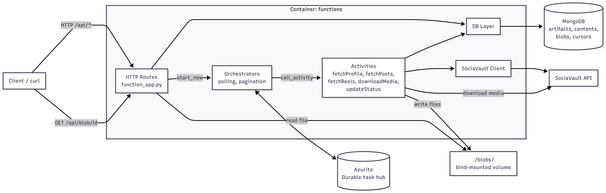

# Instagram Scrapper


An Azure Durable Functions application that scrapes Instagram profiles, posts, and reels via the [SociaVault](https://sociavault.com/) API. It downloads media files and stores metadata in MongoDB.

## Design Considerations

- **Non-blocking orchestration** - `POST /api/artifacts` returns immediately with an `artifact_id`. The scraping pipeline runs asynchronously via Azure Durable Functions. Clients poll `GET /api/artifacts/{id}` to check progress.
- **Idempotent downloads** - If the same Instagram handle is already being processed, the existing `artifact_id` is returned instead of starting a duplicate job.
- **Extensible to other platforms** - The SociaVault API client and database layer are structured so that additional social media platforms can be integrated without changing the orchestrator or endpoint logic.
- **Containerized** - Ships with a Dockerfile for deployment to Azure Functions.
- **Error isolation** - Failed API calls and download errors are caught per-activity and logged. Individual media failures do not crash the pipeline; the artifact still completes with partial results.

## Architecture



1. Fetches the Instagram profile info (display name, profile picture)
2. Fetches recent posts and reels
3. Downloads all media (images, videos, thumbnails) to a local `blobs/` directory
4. Stores metadata, content, and blob records in MongoDB
5. Sets the artifact status to `"success"` (or `"failed"` on error)

Pagination is supported - once the initial scrape completes, you can request additional pages of posts or reels via the same `POST /api/artifacts` endpoint.

## API Reference

See [docs/api.md](docs/api.md) for full API documentation with request/response examples.

| Method | Endpoint              | Description                              |
| ------ | --------------------- | ---------------------------------------- |
| `POST` | `/api/artifacts`      | Start a new scrape or request pagination |
| `GET`  | `/api/artifacts`      | List all artifacts                       |
| `GET`  | `/api/artifacts/{id}` | Get a single artifact by ID              |
| `GET`  | `/api/blob/{blob_id}` | Serve a downloaded media file            |
| `GET`  | `/api/health`         | Health check                             |

## Project Structure

```
├── function_app.py          # HTTP endpoints and response formatting
├── api_blueprint.py         # Durable orchestrators and activity functions
├── exceptions.py            # Custom exception classes
├── apis/
│   └── external_api.py      # SociaVault API client and response parsers
├── database/
│   └── db.py                # MongoDB persistence layer
├── tests/                   # Unit tests (pytest + mongomock)
├── Dockerfile               # Container image for Azure deployment
├── host.json                # Azure Functions host configuration
├── requirements.txt         # Production dependencies
└── requirements-dev.txt     # Dev/test dependencies
```

## Prerequisites

- [Docker Desktop](https://www.docker.com/products/docker-desktop/)
- A [SociaVault](https://sociavault.com/) API key

## Quickstart

### 1. Clone and add your API key

```bash
git clone https://github.com/driedsoba/instagram-scrapper.git
cd instagram-scrapper
cp .env.example .env
# Edit .env and set SOCIAVAULT_API_KEY=<your_key>
```

`.env` is gitignored. It is the **single source of truth** for secrets and is read automatically by `docker compose`.

### 2. Build and start the stack

```bash
docker compose up --build
```

This brings up three containers:

| Service | Image | Purpose |
| --- | --- | --- |
| `functions` | built from `Dockerfile` | Azure Functions runtime + scraper code |
| `mongodb` | `mongo:7` | Artifact + content + blob metadata |
| `azurite` | `mcr.microsoft.com/azure-storage/azurite` | Storage emulator for Durable Functions |

Wait for the function app to print its routes (≈ 20s on first start), then call the API at `http://localhost:7071`.

### 3. Try it out

All routes are anonymous so the stack is usable out of the box. (For an Azure deployment, put auth at the gateway level or set `auth_level=FUNCTION` in `function_app.py`.)

```bash
# Health
curl http://localhost:7071/api/health

# Start a scrape
curl -X POST http://localhost:7071/api/artifacts \
  -H "Content-Type: application/json" \
  -d '{"case_id":"test-001","identifier":"mothershipsg","description":"Test scrape"}'
# returns {"artifact_id": "<id>"}

# Request the next page of posts (or "reel") for an existing artifact
curl -X POST http://localhost:7071/api/artifacts \
  -H "Content-Type: application/json" \
  -d '{"case_id":"test-001","artifact_id":"<artifact_id>","content_type":"post"}'

# Poll for status
curl http://localhost:7071/api/artifacts/<artifact_id>

# List everything
curl http://localhost:7071/api/artifacts

# Download a media file (use a blob_id from contents[].media_content[].url)
curl http://localhost:7071/api/blob/<blob_id> --output media_file
```

### 4. Tear down

```bash
docker compose down              # stop containers, keep data
docker compose down -v           # also drop MongoDB and Azurite volumes
```

Downloaded media is bind-mounted to `./blobs/` on the host, so files survive container restarts and you can inspect them directly.

## Configuration reference

| Variable | Where it's set | Default |
| --- | --- | --- |
| `SOCIAVAULT_API_KEY` | `.env` (required) | (none) |
| `MONGODB_CONNECTION_STRING` | `docker-compose.yml` | `mongodb://mongodb:27017` |
| `AzureWebJobsStorage` | `docker-compose.yml` | Azurite well-known string |
| `WEBSITE_HOSTNAME` | `docker-compose.yml` | `localhost:80` (Durable Functions internal webhook target) |

## Running Tests

Tests run on the host (or in CI) with `mongomock`. No live MongoDB needed.

**macOS / Linux:**

```bash
python -m venv .venv
source .venv/bin/activate
pip install -r requirements-dev.txt
pre-commit install
pytest
```

**Windows (PowerShell):**

```powershell
python -m venv .venv
.venv\Scripts\Activate.ps1
pip install -r requirements-dev.txt
pre-commit install
pytest
```

**Windows (Git Bash / WSL):**

```bash
python -m venv .venv
source .venv/Scripts/activate
pip install -r requirements-dev.txt
pre-commit install
pytest
```

## CI Pipeline

The GitHub Actions workflow (`.github/workflows/ci.yml`) runs on every PR to `main`:

1. **Lint** - [Ruff](https://docs.astral.sh/ruff/) check and format verification
2. **Test** - pytest suite
3. **Security** - [Bandit](https://bandit.readthedocs.io/) static analysis

## License

[MIT](LICENSE)
